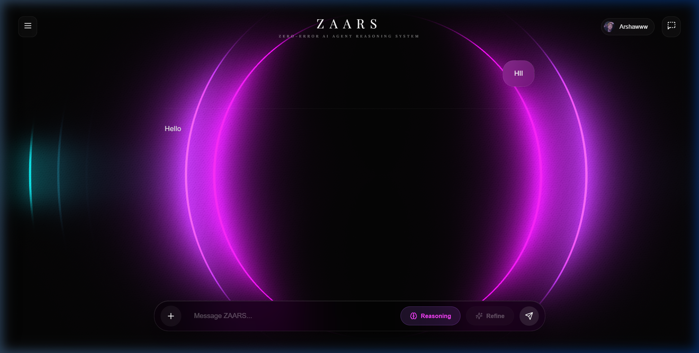
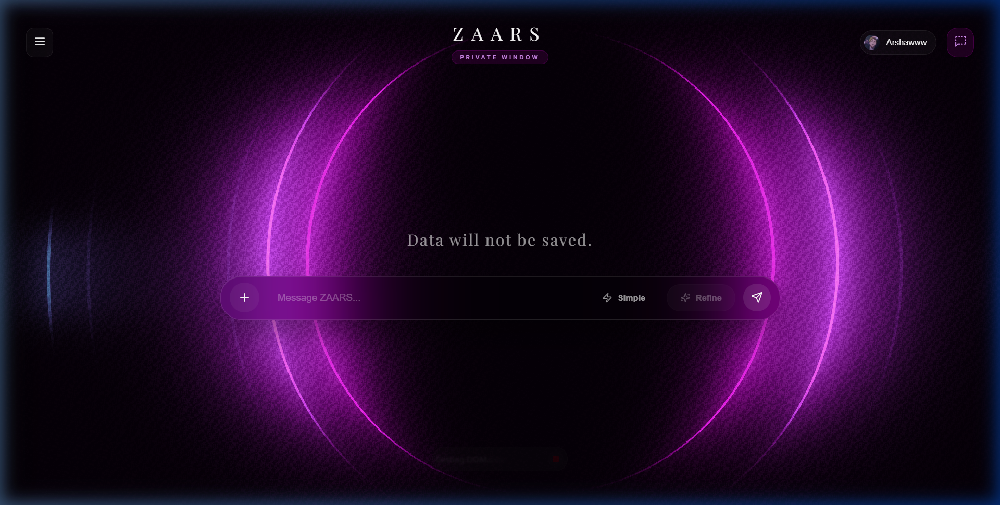
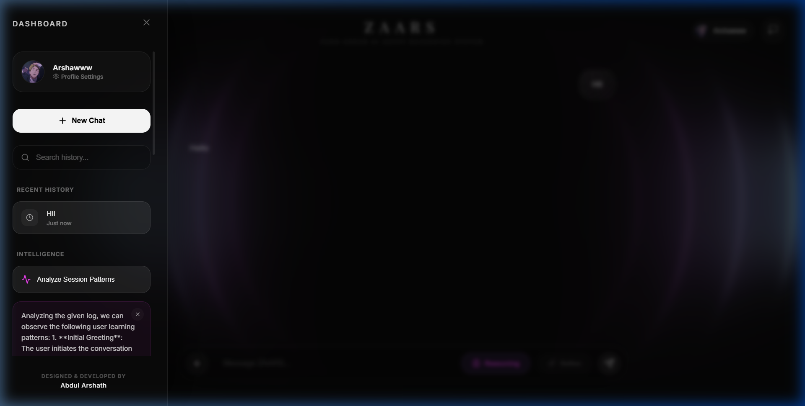

<div align="center">
  

  # 🧠 ZAARS — Zero-Error AI Agent Reasoning System

  **The ultimate mathematical reasoning engine powered by Llama 4 & Multi-File Intelligence.**

  <br />

  
  
  
  
  
</div>

---

## 📑 Table of Contents
- [✨ Problem Statement](#-problem-statement)
- [🎯 Requirements & Expected Outcome](#-requirements--expected-outcome)
- [🌟 Key Features](#-key-features)
- [📝 Project Summary](#-project-summary)
- [📂 File Architecture](#-file-architecture)
- [🌐 Live Site](https://zaars-ai.vercel.app)
- [🤖 AI Implementation](#-ai-implementation)
- [🔄 Project Workflow](#-project-workflow)
- [🏗️ System Architecture](#-system-architecture)
- [🛠️ Tech Stack](#-tech-stack)
- [🎨 UI & UX Design](#-ui--ux-design)
- [🚀 Getting Started](#-getting-started)
- [🔑 Environment Variables](#-environment-variables)
- [🧠 How It Works](#-how-it-works)
- [📸 Snapshots](#-snapshots)
- [📄 License](#-license)

---

## ✨ Problem Statement
**Solving the "Stochastic Parrot" issue in mathematical reasoning.**  
Standard AI chat interfaces often struggle with complex multi-step reasoning, particularly when dealing with long-form documents or images of handwritten notes. ZAARS bridges this gap by providing a specialized interface that prioritizes accuracy, context retention across multiple files, and structured mathematical output.

## 🎯 Requirements & Expected Outcome
- **Multi-File Context**: Simultaneously ingest PDFs, DOCX, TXT, and Images for unified analysis.
- **Dual-Mode Intelligence**: Dynamic switching between "Simple" (Fast) and "Reasoning" (Deep Chain-of-Thought) models.
- **Private Shield**: Incognito mode with local session clearing for sensitive academic or research work.
- **Premium Visualization**: A distracting-free, high-end "MagicRings" aesthetic that enhances focus.
- **Expected Outcome:** A professional-grade toolkit for students and researchers to solve problems from basic algebra to advanced calculus with zero hallucination.

---

## 🌟 Key Features
- **📂 Multi-File Intelligence:** Upload and analyze multiple documents (PDF, Word, Text) and images concurrently.
- **🧠 Chain-of-Thought Reasoning:** Powered by Llama 4 Scout for deep, logical problem-solving.
- **🌀 MagicRings Background:** A live Three.js shader background that responds to your presence and dashboard activity.
- **🛡️ Private Shield Mode:** One-click incognito session that leaves no trace in local storage.
- **📊 Session Analytics:** Analyze patterns in your learning sessions directly from the glassmorphism dashboard.

---

## 📝 Project Summary
**ZAARS** (Zero-Error AI Agent Reasoning System) is a sophisticated AI-driven platform built on **React** and **Vite**. It is designed to handle high-stakes mathematical and logical queries. Unlike generic chatbots, ZAARS implements a specialized **Multi-File Context Engine** that extracts raw text from varied document formats and pairs it with vision-capable Llama models. The result is a seamless interface where you can drop a 30MB PDF and a photo of your chalkboard and receive a synthesized, KaTeX-formatted solution instantly.

---

## 📂 File Architecture
```text
ZAARS/
├── src/                      # React Frontend
│   ├── components/           # UI Components (Magnet, MagicRings, etc.)
│   ├── App.jsx               # The Main Orchestrator & State Center
│   ├── main.jsx              # Entry Point & Providers
│   └── App.css               # Premium Glassmorphism Styles
├── server.js                 # Lightweight Session/Auth Middleware
├── package.json              # Dependency & Build Config
└── README.md                 # Project Documentation
```

---

## 🤖 AI Implementation
The brain of ZAARS is a hybrid routing system using the **Groq Cloud API**:
- **Text Reasoning:** `llama-3.3-70b-versatile` for high-speed, general-purpose math.
- **Vision & Multi-File Reasoning:** `meta-llama/llama-4-scout-17b-16e-instruct` for analyzing images and long-form document context.
- **Dynamic System Prefilling:** Automatically injects extracted document text into the "System" prompt to ensure accurate context anchoring.

---

## 🔄 Project Workflow
ZAARS follows a 3-stage intelligence pipeline:
1. **Extraction Phase:** Uses `pdfjs-dist` and `mammoth.js` to strip text from PDFs and Word docs directly in the browser's worker threads.
2. **Synthesis Phase:** Blends images (Base64) and extracted text into a single OpenAI-compatible multi-part payload.
3. **Reasoning Phase:** Routes the payload to specialized models, rendering the result using `react-markdown` and `rehype-katex` for perfect mathematical notation.

---

## 🏗️ System Architecture
```text
┌─────────────────────────────────────────────────────────────┐
│                       ZAARS CLIENT                          │
│   ┌─────────────────────────────────────────────────────┐   │
│   │               React + Three.js + Vite               │   │
│   │                 (MagicRings UI)                     │   │
│   └───────────────┬──────────────────────┬──────────────┘   │
│                   │                      │                  │
│     [ File Buffer ]│                      │[ REST API ]      │
└───────────────────┼──────────────────────┼──────────────────┘
                    │                      │
┌───────────────────▼──────────────────────▼──────────────────┐
│                   LLM REASONING LAYER (Groq)                │
│   ┌──────────────────┐  ┌────────────────┐  ┌───────────┐   │
│   │  Vision Model    │  │  Text Model    │  │ Extraction│   │
│   │  (Llama 4)       │  │  (Llama 3.3)   │  │ (PDF/DOC) │   │
│   └──────────────────┘  └────────────────┘  └───────────┘   │
└─────────────────────────────────────────────────────────────┘
```

---

## 🛠️ Tech Stack
- **Frontend:** React, Vite, Three.js
- **Styling:** CSS3 (Glassmorphism & Flexbox)
- **AI Backend:** Groq Cloud API (Llama Series)
- **Document Processing:** PDF.js, Mammoth.js
- **Icons:** Lucide-React
- **Mathematics:** KaTeX, Remark-Math

---

## 🎨 UI & UX Design
ZAARS features a **Premium Dark Aesthetic**:
- **Interactive Shaders:** The background rings blur and fade dynamically when the dashboard is open.
- **Magnet Interaction:** Buttons and inputs follow your cursor with smooth magnetic attraction.
- **Responsive Hub:** A horizontal attachment dock that manages your multiple files with live previews.

---

## 🚀 Getting Started
**1. Clone the repository**
```bash
git clone https://github.com/AbdulArshath007/ZAARS-Zero-Error-AI-Agent-Reasoning-System-.git
cd ZAARS
```

**2. Install Dependencies**
```bash
npm install
```

**3. Set Environment Variables**
Create a `.env` file:
```env
VITE_GROQ_API_KEY=your_key_here
```

**4. Start Project**
```bash
npm run dev
```

---

## ☁️ Vercel Deployment
To deploy ZAARS on Vercel:
1. **Push your code** to GitHub.
2. **Connect your repository** to Vercel.
3. **Configure Environment Variables** in Vercel Project Settings:
   - `VITE_GROQ_API_KEY`: Your Groq Cloud API Key.
   - `VITE_API_URL`: The URL of your running Node.js backend (if used).
   - `DATABASE_URL`: Your NeonDB/PostgreSQL connection string.

**Note:** If you don't set `VITE_GROQ_API_KEY` in Vercel, you can now enter it manually in the **Profile Settings** within the deployed app!

---

## 🧠 How It Works
1. **Multi-File Docking**: Drop any combination of images and documents into the chat input.
2. **Intelligent Routing**: Select "Reasoning" mode for complex problems; ZAARS will switch to higher-parameter Llama 4 models.
3. **Manual API Key**: If deployed and missing a key, go to **Profile Settings** and enter your own Groq Key safely in your browser.
4. **KaTeX Rendering**: Solutions are delivered in clear, typeset mathematical notation.
5. **Private Shield**: Toggle the "Shield" icon in the sidebar to enter a fully private session.

---

## 📸 Snapshots

### Main Command Center
<div align="center">
  
</div>

### Private Shield Mode
<div align="center">
  
</div>

### Session Intelligence Dashboard
<div align="center">
  
</div>

---

## 📄 License
This project is licensed under the MIT License - built for the **Advanced Agentic Coding** workflow.

<br />

<div align="center">
  <b>Built with ❤️ using React, Groq, and Pure Mathematical Logic ☕</b>
</div>
